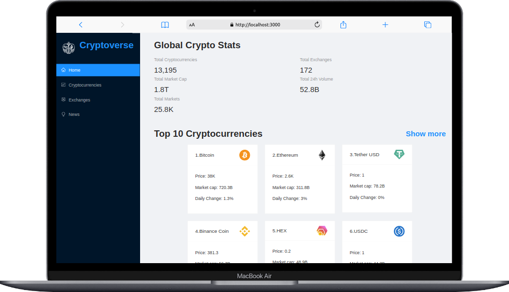

## Cryptoverse

Building and Deploying a React Cryptocurrency App and Mastering Redux Toolkit

## Built With

- Java Script
- React
- Redux
- HTML
- CSS

## React libraries used:

- ant design @ant-design/icons
- react-redux @reduxjs/toolkit
- chart.js
- html-react-parser
- millify
- moment
- react-chartjs-2
- axios

### Technologies used

- Github
- GitFlow
- Visual Studio Code
- npm
- Netlify deployment

## Demo

[Netlify](https://happy-darwin-85979d.netlify.app)

## Getting Started

To get a local copy up and running follow these simple example steps.

- go to the directory that you want to clone the repository in.
- right click and choose Git Bash here.
- type "git clone https://github.com/shoirata/crypto-dashboard.git".
- run `npm install` to install all the dependencies
- Run `npm start` to bundle the files in the src folder

or

- Go to the dist folder and open index.html

## Authors

👤 **Shoira**

- GitHub: [@shoirata](https://github.com/shoirata)
- LinkedIn: [LinkedIn](https://www.linkedin.com/in/shoira-tashpulatova-bab4a7122/)

## Acknowledgments

- Microverse

## 📝 License

This project is [MIT](MIT.md) licensed.

## Show your support

Give a ⭐️ if you like this project!
